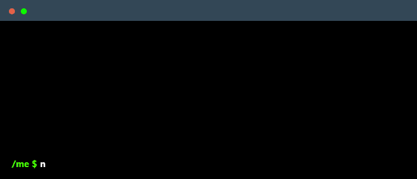

Hi, I am a 20-year-old individual residing in Iran. chasing my passion and building my career path, eager to embrace new challenges and grow both personally and professionally. I possess strong adaptability and communication skills, enabling effective collaboration with diverse teams. I am driven by a passion for learning and am committed to making a positive impact in any role I undertake. So, with all that said I am and will be trying to learn more and more about this amazing field of science that I love in order to make all lives around this globe of ours easier and better.

 

 

<h3>Skills:</h3>

<code></code>
<code></code>
<code></code>
<code></code>
<code></code>
<code></code>
<code></code>
<code></code>
<code></code>
<code></code>
<code></code>
<code></code>
<code></code>
<code></code>
<code></code>

 

<h3>Where to find me</h3>

 &nbsp;
 &nbsp;
 &nbsp;

